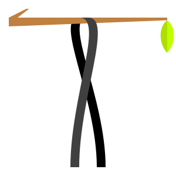

# Tonbandfetzen

Tonbandfetzen is a collection of command-line tools that allow you to compose
music based on audio fragments generated from plain text input. It contains:

* `mel` - generate sound fragments from plain text
* `guitar` - read guitar tablature
* `stick` - concatenate audio data
* `stack` - superimpose audio data
* `stretch` - rescale audio data
* `repeat` - loop audio data
* `trim` - strip leading and trailing silence
* `mono` - unzip audio channels
* `harmonics` - show spectra of wave samples
* `inspect` - show information on audio file
* `riff2aiff` - convert .wav(e) into .aif(f) files
* `aiff2riff` - convert .aif(f) into .wav(e) files
* `tag` - add ID3v2 metadata to .wav(e) files

## Usage

Different task are spread across separate executables, which communicate via
files in the Waveform Audio File Format (.wav). Hence, the composition process
can be controlled using build-automation software, allowing for partial updates
and parallel execution (`make -j`).

At the heart of this toolbox, the program `mel` converts text into audio (try
[here](https://janber.de/mel.cgi)):

    echo "T pyth M A2'8 W ,5 A2' A3' E4' A4' C#v5' E5' Gz5' A5'" | mel | aplay

It partially supports the [Functional Just System](https://misotanni.github.io)
for just intonation invented by misotanni.

## Installation

You will need a recent Fortran compiler. For some features, Python (guitar
tablatures) and eSpeak NG with MBROLA (example) are required additionally.
Using APT, these prerequisites can be installed as follows:

    sudo apt install gfortran python3 espeak-ng mbrola-de5

To compile the binaries, you can use the provided makefile:

    cd /path/to/Tonbandfetzen
    make FC=gfortran FFLAGS=-O3

To make the tools and documentation accessible, consider adding the following
lines to your .bashrc:

    REPO=/path/to/Tonbandfetzen
    export PATH=$REPO/bin:$PATH
    export PERL5LIB=$REPO/perl/lib:$PERL5LIB
    export MANPATH=$REPO/doc:$MANPATH

You might also want to link the Vim syntax file to the appropriate location:

    ln -s /path/to/Tonbandfetzen/vim/mel.vim ~/.vim/syntax/mel.vim

To have Vim detect the corresponding file types, add this line to your .vimrc:

    autocmd BufRead,BufNewFile *.mel,*.gtr setlocal filetype=mel

## Documentation

Please have a look at the examples (or listen to them
[here](https://janberges.github.io/Tonbandfetzen)):

    cd examples/freedom
    make -j 2
    aplay freedom.wav

The man pages can be viewed [here](https://janberges.github.io/Tonbandfetzen)
or in the terminal:

    man mel

## Hear also

The name Tonbandfetzen originates from the song Explosion by Tocotronic from
their 2007 album Kapitulation.
